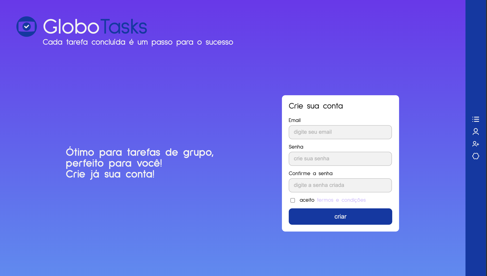

# Projeto Módulo 6 — Globotech

Projeto Fase 6 - Sistema de Controle de Tarefas (To-Do List com API e JavaScript)Projeto Módulo 5 — Globotech
> Status do módulo: Front-End dinâmico (HTML + CSS + JavaScript).
Neste módulo, os dados deixam de ser mockados no HTML e passam a ser manipulados via JavaScript, com persistência em uma API REST (crudcrud).

---

**Preview da Página Inicial:**  




## Objetivo

Evoluir o protótipo do Módulo 5, implementando:
- CRUD de usuários (criar, listar, editar, excluir).
- CRUD de listas associadas a usuários.
- CRUD de tarefas dentro de cada lista.
- Integração real com API REST para persistência.
- Organização modular do código com JavaScript separado por página e serviços centralizados.

---

## Estrutura sugerida do repositório

```
Projeto-Modulo-6---Globotech/
│
├── assets/              # Recursos visuais
│   ├── globotask.png
│   └── home.png
│
├── components/          # Componentes reutilizáveis (header, footer)
│   ├── header.html
│   └── footer.html
│
├── css/
│   └── style.css        # Estilos globais e responsivos
│
├── html/                # Estrutura das páginas
│   ├── conta.html       # Conta principal
│   ├── cria-user.html   # Criação de usuários
│   ├── index.html       # Página inicial
│   ├── listas.html      # Listas de tarefas
│   ├── nova-lista.html  # Criar nova lista
│   └── usuarios.html    # Usuários cadastrados
│
├── js/                  # Scripts modulares
│   ├── app.js           # Inicialização global e componentes
│   ├── conta.js         # Lógica da tela de conta
│   ├── cria-user.js     # Lógica de criação de usuário
│   ├── index.js         # Lógica da home
│   ├── listas.js        # Lógica da tela de listas
│   ├── nova-lista.js    # Lógica de criação de lista
│   ├── usuarios.js      # Lógica da tela de usuários
│   └── services.js      # Comunicação com API (crudcrud)
│
├── node_modules/        # Dependências (quando usar npm)
│
├── LICENSE
├── package.json
├── package-lock.json
└── README.md
```
---
## Integração com API (crudcrud)

Para simular um backend real, utilizamos o serviço crudcrud
, que gera uma API REST online de forma gratuita.
---

## Projetos Anteriores
> Este projeto dá continuidade às fases anteriores do Projeto Unificado Globotech (Módulos 1 a 4) e prepara o terreno para o módulo seguinte com JavaScript.


🔗 [Projeto‑Modulo‑1 — Globotech](https://github.com/mirrabernardo/Projeto-Modulo-1---Globotech)  

**Fase 1 – Análise de Engajamento com Python Puro**  
Projeto desenvolvido com Python padrão, sem dependências externas. Implementa scripts para leitura, limpeza e validação de interações em CSV.

🔗 [Projeto‑Modulo‑2 — Globotech](https://github.com/mirrabernardo/Projeto-Modulo-2---Globotech)  

**Fase 2 – Evolução com Programação Orientada a Objetos (POO)**  
Refatoração do sistema usando POO com lógica de processamento orquestrada pela classe SistemaAnaliseEngajamento.

🔗 [Projeto‑Modulo‑3 — Globotech](https://github.com/mirrabernardo/Projeto-Modulo-3---Globotech)  

**Fase 3 – Estruturas de Dados: Fila e Árvore Binária (BST)**  
Implementação de ingestão via fila FIFO e gerenciamento de dados através de árvores binárias de busca (BST) para armazenar e buscar usuários e conteúdos de forma eficiente.

🔗 [Projeto‑Modulo‑4 — Globotech](https://github.com/mirrabernardo/Projeto-Modulo-4---Globotech)

**Fase 4 – Projeto Unificado com Banco de Dados Relacional**
Integração do sistema de análise de engajamento com persistência em banco de dados MySQL. Abrange modelagem conceitual e lógica (MER/DER), criação do schema relacional, carga de dados automatizada e execução de consultas SQL para análises otimizadas. O projeto consolida as fases anteriores em uma arquitetura escalável e estruturada, conectando Python e SQL de forma integrada.


## Equipe

<table>
  <tr>
    <td align="center">
      <a href="https://github.com/mirrabernardo">
        <br>
        <strong>Mirra</strong>
      </a>
    </td>
    <td align="center">
      <a href="https://github.com/TalesHonorio">
        <br>
        <strong>Tales</strong>
      </a>
    </td>
    <td align="center">
      <a href="https://github.com/andrelassis">
        <br>
        <strong>André</strong>
      </a>
    </td>
  </tr>
</table>
